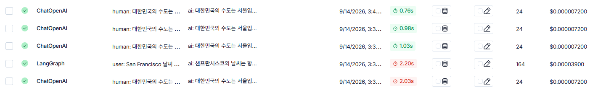

# LangSmith 연결 및 트레이싱(Tracing) 켜고 끄기

09/14 실습. [`ch04_2_langsmith.ipynb`](ch04_2_langsmith.ipynb) — LangChain 호출 내역을
**LangSmith**에서 추적(tracing)할 수 있도록 연결하고, 프로젝트 단위로 추적을 켜고 끄는 방법을 다룹니다.

---

## 1. LangSmith란?

**LangSmith**는 LangChain에서 만든 **LLM 호출 로그 & 디버깅 대시보드**입니다.
`llm.invoke()` 등으로 모델을 호출할 때마다, 어떤 입력(프롬프트)이 들어가서 어떤 출력이 나왔는지,
호출에 걸린 시간과 사용된 토큰 수까지 웹 대시보드([smith.langchain.com](https://smith.langchain.com))에서
한눈에 확인할 수 있게 해줍니다. 코드에 `print`를 넣어 직접 로그를 남기지 않아도, 연결만 해두면
LangChain 호출이 자동으로 기록됩니다.

## 2. 필요한 환경변수 (`.env`)

OpenAI 키 외에 LangSmith 관련 값들이 추가로 필요합니다.

```env
# .env  (이 폴더에 이미 있음. 커밋 대상 아님)
OPENAI_API_KEY=sk-proj-...

LANGSMITH_TRACING=true
LANGSMITH_ENDPOINT=https://api.smith.langchain.com
LANGSMITH_API_KEY=lsv2_pt_...
LANGSMITH_PROJECT=test0914
```

- `LANGSMITH_API_KEY` : [smith.langchain.com](https://smith.langchain.com) 에서 발급받는 LangSmith 전용 키
  (`lsv2_pt_...` 형식). OpenAI 키와는 별개의 키입니다.
- `LANGSMITH_PROJECT` : 대시보드에서 호출 기록을 묶어서 보여줄 **프로젝트 이름**. 값을 바꾸면 그 이름의
  새 프로젝트로 기록됩니다.
- `LANGSMITH_TRACING=true` : 이 값이 `true`일 때 LangChain이 호출 내역을 LangSmith로 자동 전송합니다.

```python
from dotenv import load_dotenv
import os

load_dotenv()

print("OpenAI 키:", os.getenv("OPENAI_API_KEY")[:8] + "...")
print("LANGSMITH 키:", os.getenv("LANGSMITH_API_KEY")[:8] + "...")
print("LangSmith 프로젝트:", os.getenv("LANGSMITH_PROJECT"))
```

## 3. 그냥 호출하면 자동으로 추적됨

`.env`에 `LANGSMITH_TRACING=true`가 설정되어 있으면, 평소처럼 `ChatOpenAI`를 호출하기만 해도
**별도 코드 없이** LangSmith 대시보드에 호출 기록이 남습니다.

```python
from langchain_openai import ChatOpenAI

llm = ChatOpenAI(model="gpt-4o-mini")
response = llm.invoke("대한민국의 수도는 어디인가요?")
print(response.content)
# -> 대한민국의 수도는 서울입니다.

# 이 호출 내역은 LangSmith 대시보드(LANGSMITH_PROJECT로 지정한 프로젝트)에서 확인 가능
```

### 연결 확인 — 실제 대시보드 화면

아래 스크린샷은 위 코드처럼 `ChatOpenAI`(및 `LangGraph`) 호출을 실행한 뒤, LangSmith 대시보드에
**Input/Output이 함께 기록**된 걸 직접 확인한 화면입니다. 모든 행이 초록색 체크(✅)로 표시되어
정상적으로 추적(tracing)되고 있음을 보여줍니다.



> 위 이미지 파일(`langsmith_trace_check.png`)은 이 폴더에 아직 추가되지 않았습니다.
> 스크린샷 파일을 `ex0914/langsmith_trace_check.png` 경로에 저장하면 이 README에 정상적으로 표시됩니다.

## 4. `langchain_teddynote`로 프로젝트 단위 추적 켜고 끄기

`.env`의 `LANGSMITH_TRACING` 값을 직접 수정하지 않고도, 코드에서 특정 프로젝트로 추적을
켜고 끌 수 있는 헬퍼 패키지입니다.

```python
# !pip install langchain_teddynote
from langchain_teddynote import logging

# 랭스미스 추적하기 (proj0913 프로젝트로 기록 시작)
logging.langsmith("proj0913", set_enable=True)
# -> LangSmith 추적을 시작합니다.
#    [프로젝트명]
#    proj0913
```

```python
# 랭스미스 추적하지 않기
logging.langsmith("proj0913", set_enable=False)
# -> LangSmith 추적을 하지 않습니다.
```

- `logging.langsmith(프로젝트명, set_enable=True)` : 내부적으로 `LANGSMITH_TRACING`,
  `LANGCHAIN_PROJECT` 같은 환경변수를 그 자리에서 설정해서, `.env` 파일을 안 건드리고도
  실행 중에 추적 대상 프로젝트를 바꾸거나 켜고 끌 수 있게 해줍니다.
- 실습·디버깅 중에만 잠깐 추적을 켜고, 끝나면 `set_enable=False`로 꺼서 불필요한 로그가
  쌓이지 않도록 관리할 수 있습니다.

## 주의 — API 키 보안

- `.env`의 `OPENAI_API_KEY`, `LANGSMITH_API_KEY` 모두 **비밀번호와 동일하게 취급**합니다.
  레포 루트 `.gitignore`에 `.env`가 등록되어 있어 커밋되지 않습니다.
- 키를 출력할 땐 이 노트북처럼 앞 8자리만 잘라서(`[:8]`) 확인하고, 전체 값을 print하거나
  스크린샷에 노출하지 않습니다.
